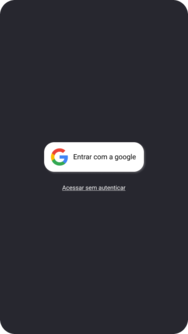
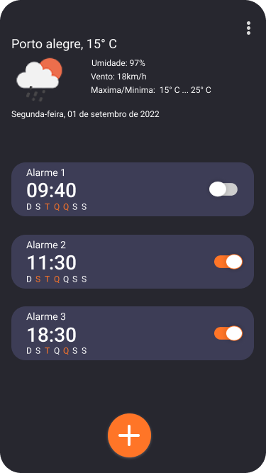
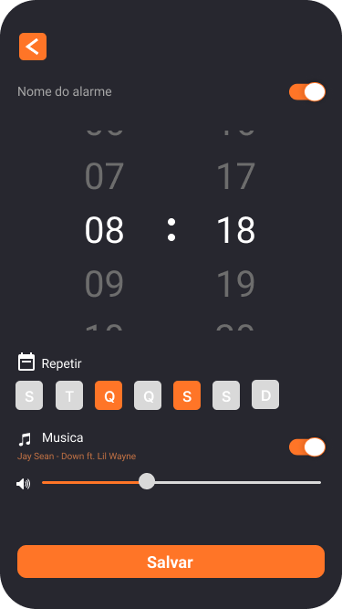
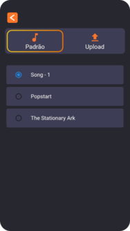
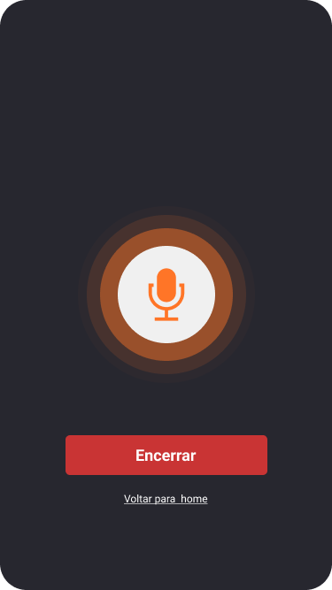

# ⏰ Despertador Inteligente

Aplicativo mobile desenvolvido em **Flutter**, que vai além das funcionalidades básicas de um despertador. Ao despertar, o app mostra **previsão do tempo** e **eventos do Google Agenda**, facilitando a organização da rotina do usuário.

## Funcionalidades

- Alarme com nome, dias da semana e música personalizada  
- Previsão do tempo atual com base na localização  
- Integração com Google Calendar (agenda do dia)  
- Comando por voz ao despertar  
- Notificações personalizadas (Awesome Notifications)  
- Armazenamento local com SQLite 

## Tecnologias

- [Flutter](https://flutter.dev/)  
- [Firebase](https://firebase.google.com/)  
- [SQLite](https://www.sqlite.org/index.html)  
- [Google Calendar API](https://developers.google.com/calendar)  
- [HG Weather API](https://hgbrasil.com/status/weather)  
- [GitHub](https://github.com/) para versionamento

## Testes

O app foi testado com usuários reais por meio de formulários no Google Forms, recebendo **feedbacks positivos** sobre usabilidade, praticidade e design. A maioria dos usuários aprovou a proposta e achou o app útil para o dia a dia.

## Objetivo

Criar uma ferramenta que desperte o usuário e, ao mesmo tempo, informe **clima e compromissos**, otimizando seu tempo e evitando esquecimentos e imprevistos climáticos.

## Screenshots

  
  
  
  
  

