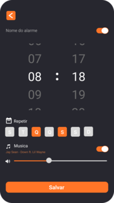

# ⏰ Despertador Inteligente

Aplicativo mobile desenvolvido em **Flutter**, que vai além das funcionalidades básicas de um despertador. Ao despertar, o app mostra **previsão do tempo** e **eventos do Google Agenda**, facilitando a organização da rotina do usuário.

## 🚀 Funcionalidades

- ⏰ Alarme com nome, dias da semana e música personalizada  
- 🌤️ Previsão do tempo atual com base na localização  
- 📅 Integração com Google Calendar (agenda do dia)  
- 🎙️ Comando por voz ao despertar  
- 📲 Notificações personalizadas (Awesome Notifications)  
- 💾 Armazenamento local com SQLite  
- 🌙 Interface com modo escuro e design intuitivo

## 🛠️ Tecnologias

- [Flutter](https://flutter.dev/)  
- [Firebase](https://firebase.google.com/)  
- [SQLite](https://www.sqlite.org/index.html)  
- [Google Calendar API](https://developers.google.com/calendar)  
- [HG Weather API](https://hgbrasil.com/status/weather)  
- [GitHub](https://github.com/) para versionamento

## 🧪 Testes

O app foi testado com usuários reais por meio de formulários no Google Forms, recebendo **feedbacks positivos** sobre usabilidade, praticidade e design. A maioria dos usuários aprovou a proposta e achou o app útil para o dia a dia.

## 📌 Objetivo

Criar uma ferramenta que desperte o usuário e, ao mesmo tempo, informe **clima e compromissos**, otimizando seu tempo e evitando esquecimentos e imprevistos climáticos.

## 📷 Screenshots

<p float="left">
  
  
  
  
  
</p>

> (Adicione aqui imagens do app se quiser)

## 📲 Instalação

```bash
# Clone o repositório
git clone https://github.com/seu-usuario/seu-repo.git

# Navegue até a pasta
cd seu-repo

# Instale as dependências
flutter pub get

# Execute o projeto
flutter run
